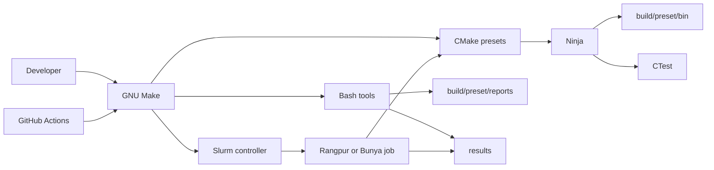

# Infrastructure

## Targets

- [x] `m0`: serial formative program
- [ ] `m1`: serial, compiler SIMD disabled
- [ ] `m2`: parallel milestone
- [ ] `a1`: local assignment driver

`m0` is the only current entrypoint. CMake picks up the others when their
`main.cpp` files appear.

| Target | Kind | Main rule | Output |
| --- | --- | --- | --- |
| `m0` | Formative | Serial; scalar in peak-like modes | `bin/m0` |
| `m1` | Serial | No OpenMP, MPI, CUDA, or SIMD | `bin/m1` |
| `m2` | Parallel | Add only measured parallel code | `bin/m2` |
| `a1` | Assignment | GradeBot build rules win | `bin/a1` |

Every output path above sits below `build/<preset>/`.

## How it hangs together



Make dispatches commands; CMake configures targets, Ninja builds, and CTest
runs tests. Bash handles checks, measurements, reports, and Slurm.

## Layers

| Layer | Files | What it does |
| --- | --- | --- |
| Programs | `proj/`, later `assign/` | Coursework source and entrypoints |
| Build | `CMakeLists.txt`, `CMakePresets.json` | Targets and build modes |
| Build rules | `tools/config/toolchains/` | Flags, target rules, reports |
| Commands | `Makefile` | Short command interface |
| Automation | `tools/scripts/tools/` | Bash checks and tooling |
| Cluster jobs | `tools/scripts/slurm/`, `proj/*/*.slurm` | Slurm execution |
| Measurement | `benches/` | C++ harness and target adapters |
| CI | `.github/workflows/` | Hosted checks, not speed claims |

## Build model

The checked-in presets use CMake 3.25 or newer, C++20, Ninja, and an
out-of-source build. CMake also writes `compile_commands.json` below the
selected build directory. CMake downloads nothing while configuring: no
`FetchContent`, Git clone, or package-manager bootstrap.

The root build has one target helper:

```cmake
hpc_add_entrypoint(
    NAME m0
    SOURCE "${PROJECT_SOURCE_DIR}/proj/m0/main.cpp"
    KIND formative
)
```

That helper checks the target name against its kind, fixes the executable
name, writes it under `bin/`, and attaches only the interface targets created
for the active mode.

| Interface target | Created when | Carries |
| --- | --- | --- |
| `hpc_warnings` | `check` | Probed warnings, debug info, optional `-Werror` |
| `hpc_peak` | Peak-like modes | `-O3`, `NDEBUG` |
| `hpc_profile` | `profile` | `-O3 -g -fno-omit-frame-pointer` |
| `hpc_security` | Sanitiser selected | One compatible sanitiser lane |
| `hpc_coverage` | Coverage selected | LLVM or GCC coverage flags |

`m0` and future `m1` peak-like builds explicitly disable loop and SLP
vectorisation. Clang uses `-fno-vectorize -fno-slp-vectorize`; GCC uses
`-fno-tree-loop-vectorize -fno-tree-slp-vectorize`. This keeps the baseline
scalar.

### Modes

| `HPC_MODE` | Optimisation | Instrumentation | Use |
| --- | --- | --- | --- |
| `check` | Compiler default | Warnings and symbols | Editing and CI |
| `profile` | `-O3` | Symbols and frame pointers | CPU profiling |
| `peak` | `-O3` | None | Clean timing |
| `coverage` | Compiler default | One coverage runtime | Test reach |
| `pgo-generate` | `-O3` | Profile counters | Training run |
| `pgo-use` | `-O3` | Uses matching profile | PGO candidate |
| `bolt-input` | `-O3` | Symbols and ELF relocations | BOLT input |

CMake rejects mixed modes such as coverage in a peak build or a sanitiser
outside `check`. LTO is accepted only for peak and PGO modes, is checked with
`CheckIPOSupported`, and is not applied to `a1`.

### Presets

| Preset family | Compiler or role |
| --- | --- |
| `mac-check`, `mac-peak` | AppleClang 21 on ARM64 |
| `rangpur-check`, `rangpur-peak` | Clang 21; peak needs Slurm |
| `bunya-check`, `bunya-peak` | GCC 14; peak needs Slurm |
| `profile` | Optimised binary with usable stacks |
| `asan-ubsan`, `tsan`, `msan` | Separate sanitiser builds |
| `coverage-clang`, `coverage-gcc` | Separate coverage runtimes |
| `pgo-generate`, `pgo-use` | One matching PGO directory |
| `bolt-input` | Linux ELF candidate input |

The cluster peak presets refuse to configure without `SLURM_JOB_ID`. Native
CPU matching is then checked by the Slurm scripts inside the allocation.

## Configuration

There are three small nested YAML files:

| File | Owns |
| --- | --- |
| `tools/config/clang.yml` | Format, tidy, compiler, and sanitiser flags |
| `tools/config/tool.yml` | Checks, coverage, security, profiling, HPC |
| `tools/config/benchmark.yml` | Tiers, outputs, gates, bootstrap, PGO |

The Bash reader rejects unknown and duplicate keys. It uses no Python or
`yq`. Configuration is parsed outside timed regions.

Compiler selection lives separately:

```text
tools/config/toolchains/compiler/
├── bunya-gcc14.cmake
├── mac-appleclang21.cmake
└── rangpur-clang21.cmake
```

## Where commands go

Commands use `make <word> <action>`. The positional parser passes one action
to the matching script.

| Command | Runs | Writes |
| --- | --- | --- |
| `make check ...` | `tools/scripts/tools/check` | Build tree only |
| `make fmt [fix]` | `tools/scripts/tools/fmt` | Source only with `fix` |
| `make san au\|t\|m` | `tools/scripts/tools/san` | Sanitiser build |
| `make cov ...` | `tools/scripts/tools/coverage` | `results/coverage/` |
| `make bench ...` | `tools/scripts/tools/bench` | Raw and summary CSV |
| `make pgo gen\|use` | `tools/scripts/tools/bench` | PGO data |
| `make profile ...` | `tools/scripts/tools/profile` | Profile reports |
| `make explore ...` | `tools/scripts/tools/explore` | Binary reports |
| `make hpc <command>` | `tools/scripts/tools/hpc` | Doctor or Slurm state |
| `make submit` | Slurm controller | `results/slurm/` |
| `make package a1` | `tools/scripts/tools/package` | Staged files only |
| `make clean [all]` | Shared safe cleaner | Selected or all output |

Shared shell helpers handle validation, command printing, and safe cleaning.
They remain compatible with macOS Bash 3.2.

## Checks and diagnosis

| Lane | Main command | Rule |
| --- | --- | --- |
| Format | `make fmt` | Clang format plus 80-column text check |
| Lint | `make check lint` | Tidy, cppcheck, ShellCheck, shfmt, actionlint |
| Static | `make check analyze` | `scan-build` and GCC `-fanalyzer` |
| Tests | `make test` | CTest for the selected preset |
| Memory/UB | `make san au` | ASan, UBSan, and leak checks |
| Host races | `make san t` | TSan in its own build |
| Uninitialised reads | `make san m` | MSan only with a complete runtime |
| Coverage | `make cov llvm` or `gcov` | One compiler family per build |
| Linux memory tools | `make profile memcheck` | Small Valgrind cases |
| Counters | `make profile perf-stat` | Separate from clean timing |
| Binary inspection | `make explore binary` | Sections, symbols, runtime |

Optional tools print `SKIP` when missing or unsupported. A failed installed
tool fails the command.

## Benchmark path

The dependency-free C++ harness builds as:

```text
build/<preset>/bench/hpc_bench
```

Each program gets a small adapter such as `benches/m0.cpp`; shared timing and
CSV code stays in `benches/bench.cpp`. The current adapter measures process
startup only. See [Performance](performance.md) for the exact timer, sample
counts, bootstrap calculation, and limits.

## Cluster path

The controller validates resource counts and exports them to one shared job:

```text
make submit
    -> tools/scripts/tools/hpc
    -> tools/scripts/slurm/<cluster>.sbatch
    -> srun with explicit binding
```

Target-owned jobs, such as `proj/m0/m0.slurm`, stay beside the target. Machine
and resource details are in [Clusters](cluster.md).

## GitHub

| Workflow | Runs | Checks |
| --- | --- | --- |
| `check.yml` | Build, quality, coverage | Linux/macOS build and checks |
| `benchmark.yml` | Harness, PGO, BOLT input | Benchmark setup still runs |
| `security.yml` | CodeQL, static analysis, sanitisers | Finds code defects |
| `explore.yml` | Linux binary and topology reports | Report generation |

Actions call Make targets and pin every action to a full commit SHA. Workflow
permissions default to read-only contents. The CodeQL job adds the narrow
permissions needed to upload C/C++ results to private code scanning. It uses
a manual GCC 14 build and the `security-extended` query suite.

All jobs use GitHub-hosted runners. There is no self-hosted runner, Pages,
release, deployment, or public benchmark upload.

### Dependency graph

Dependency submission accepts Package URLs, but this repo has no vcpkg,
Conan, or other package manifest. There is no package/version data to send.

Dependabot checks the pinned GitHub Actions weekly and keeps at most three
version-update pull requests open. Security alerts and security updates are
enabled in the repository settings.

As checked on 24 August 2026, Actions allow only GitHub-owned, SHA-pinned
actions.

<details>
<summary><strong>Generated output map</strong></summary>

| Path | Contents |
| --- | --- |
| `build/<preset>/bin/` | Coursework programs |
| `build/<preset>/bench/` | Benchmark helper |
| `build/<preset>/reports/` | Compiler reports |
| `build/<preset>/configured-host.txt` | Configure-time build identity |
| `results/raw/` | Raw benchmark rows |
| `results/summary/` | Aggregate benchmark rows |
| `results/coverage/` | LLVM or GCC coverage |
| `results/profiles/` | Profiler and binary reports |
| `results/slurm/` | Shared Slurm logs |
| `build/submission/a1/` | Checked local assignment package |

</details>

## Assignment files

`make package a1` stages the three implementation files and `slurm.zip` in
`build/submission/a1/`. It does not upload them.
