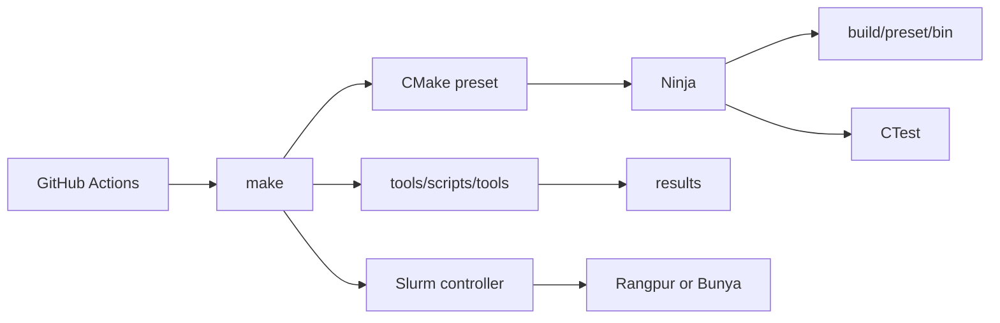
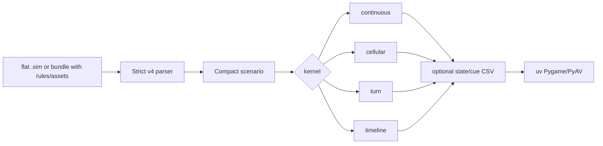

# Infrastructure

> [!NOTE]
> This is a small lab, not a platform. CMake builds, CTest tests, Make is the
> short front door, and Bash connects the existing tools.

## Path through the repo

| Layer | Owns |
| --- | --- |
| `proj/` | Coursework entrypoints, M1 bundles and renderer |
| `CMakeLists.txt`, `CMakePresets.json` | Targets, modes and build trees |
| `tools/config/` | Compiler, tool, Brew and Spack policy |
| `Makefile` | Short human and CI commands |
| `tools/scripts/tools/` | Checks, measurement and packaging |
| `tools/scripts/slurm/`, `proj/*/*.slurm` | Cluster launch |
| `benches/` | C++ timing, CSV and statistics |
| `.github/workflows/` | Hosted checks, never course speed claims |

## Build

The C++ path needs CMake 3.25+, Ninja and C++20. Each preset writes to
`build/<preset>/`; in-source configuration fails. `compile_commands.json`
lives in that build directory. No CMake configure step downloads code.

| Policy target | Carries |
| --- | --- |
| `hpc_warnings` | Probed warnings, symbols and optional `-Werror` |
| `hpc_peak` | `-O3` and `NDEBUG` |
| `hpc_profile` | Optimisation, symbols and frame pointers |
| `hpc_security` | One compatible sanitiser |
| `hpc_coverage` | LLVM or GCC coverage, never both |

M1 links `m1_core`: the parser, four execution modes, bounded Lua host and
native search code. Both Clang and GCC builds explicitly disable loop and SLP
vectorisation for that target. Cluster presets leave Lua off unless a
prepared user environment is explicitly selected. `m0` remains independent
of it.

| Preset | Use |
| --- | --- |
| `mac-check`, `mac-peak` | AppleClang local work |
| `rangpur-check`, `rangpur-peak` | Rangpur Clang; peak needs Slurm |
| `bunya-check`, `bunya-peak` | Bunya GCC; peak needs Slurm |
| `profile` | Optimised code with useful stacks |
| `asan-ubsan`, `tsan`, `msan` | Separate diagnostics |
| `coverage-clang`, `coverage-gcc` | Separate coverage systems |
| `pgo-generate`, `pgo-use` | Matching profile experiment |

## M1 engine

The scenario itself is the interface. Scenario values compile into contiguous
typed plans and state before the first step. Names, shapes, behaviours, rules,
assets, state keys and cue kinds become compact IDs. The continuous loop then
does only simulation work.

LuaJIT is embedded, bounded by source, memory, instruction and command caps,
and exposed only through the scenario callbacks. It has no file, process,
module, FFI, debug or inherited host environment. That is a safety belt for
reviewed scripts, not a promise that hostile Lua is safe.

The Python renderer consumes CSV state and cue streams. Pygame draws frames;
PyAV decodes video cues; ffmpeg encodes an optional MP4. It owns presentation,
not simulation semantics.

## Dependencies

| File | Purpose |
| --- | --- |
| `tools/config/Brewfile` | Local Mac tools, LuaJIT and ffmpeg |
| `tools/config/spack.yaml` | Rootless cluster LuaJIT environment |
| `pyproject.toml`, `uv.lock` | Locked Pygame and PyAV visualiser |
| `CMakeLists.txt` | `pkg-config` LuaJIT 2.1 compile/link probe |

GitHub's dependency graph sees the PyPI packages from `pyproject.toml` and
`uv.lock`. There is no vcpkg, Conan or downloaded C++ dependency graph.
The Spack file is an environment recipe, not something CMake runs. Cluster
jobs never install packages; prepare and activate the environment first.

> [!IMPORTANT]
> Keep the repo private. Workflows do not publish source, scenario assets,
> reports, packages or benchmark claims.

## Commands and generated output

| Command | Writes |
| --- | --- |
| `make check` | Build tree and check logs |
| `make san` | Separate diagnostic build |
| `make cov` | `results/coverage/` |
| `make bench` | `results/raw/`, `results/summary/` |
| `make profile`, `make explore` | `results/profiles/` where relevant |
| `make hpc` | Doctor report or Slurm state |
| `make package m1` | `build/submission/m1/m1.zip` |
| `make clean all` | Deletes `build/`, `results/` and Python scratch |

The scripts target macOS Bash 3.2, validate inputs and print commands before
running them. A missing optional tool says `SKIP`; an installed tool that fails
is a failure.

## CI and Codespaces

| Workflow | Work |
| --- | --- |
| `check.yml` | Format, lint, Linux/macOS builds, tests and coverage |
| `benchmark.yml` | Harness, CSV gates, PGO and BOLT-input smoke |
| `security.yml` | Private-repository CodeQL, analysis and sanitisers |
| `explore.yml` | Safe topology and binary reports |

Actions call Make rather than cloning command policy. They use private
artefacts for bounded logs and reports, never public releases, Pages or
benchmark uploads. Dependabot covers Actions, the devcontainer and uv.

Codespaces installs LuaJIT, FFmpeg and Ninja, syncs the locked uv environment,
then runs the profile test suite. It is useful for editing and diagnosing; it
is not a replacement for a UQ cluster allocation.
