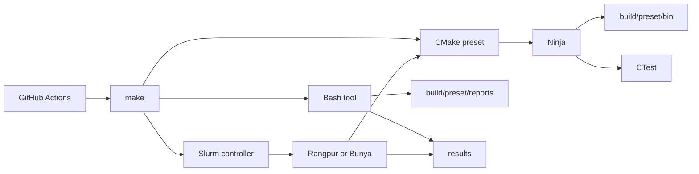

# Infrastructure

> [!NOTE]
> This is a small lab, not a platform. Make routes commands, CMake owns the
> build, CTest owns tests, and Bash joins tools together. No package manager,
> service or framework sits in the C++ build path.

## Execution path



The boundaries are deliberate:

| Layer | Owns |
| --- | --- |
| `proj/`, later `assign/` | Coursework code and entrypoints |
| `CMakeLists.txt`, `CMakePresets.json` | Targets, modes, build trees |
| `tools/config/toolchains/` | Flags, target policy, reports |
| `Makefile` | Short commands for humans and CI |
| `tools/scripts/tools/` | Checks, sanitisers, measurement, reports |
| `tools/scripts/slurm/` | Shared cluster jobs |
| `proj/*/*.slurm` | Small target-owned jobs |
| `benches/` | C++ timing, statistics and target adapters |
| `.github/workflows/` | Hosted checks, never course speed claims |

## Build model

The build requires CMake 3.25+, C++20 and Ninja. Every preset writes to
`build/<preset>/`; in-source builds fail. `compile_commands.json` stays in
that build tree. Configure does no network work: no `FetchContent`, clone or
package bootstrap.

One helper creates production entrypoints:

```cmake
hpc_add_entrypoint(
    NAME m0
    SOURCE "${PROJECT_SOURCE_DIR}/proj/m0/main.cpp"
    KIND formative
)
```

It checks the target/kind pair, fixes the output name, writes to `bin/`, then
attaches only the flags built for that mode. The only production names are
`m0`, `m1`, `m2` and `a1`; a target exists only when its `main.cpp` exists.

| Kind | Contract |
| --- | --- |
| `formative` | Serial `m0`; scalar in peak-like modes |
| `serial` | `m1`; no OpenMP, MPI, CUDA or compiler SIMD |
| `parallel` | `m2`; parallel features only when real code needs them |
| `assignment` | `a1`; supplied GradeBot rules beat local policy |

### Interface targets

| Target | Built when | Carries |
| --- | --- | --- |
| `hpc_warnings` | `check` | Probed warnings, symbols, optional `-Werror` |
| `hpc_peak` | Peak-like modes | `-O3`, `NDEBUG` |
| `hpc_profile` | `profile` | `-O3 -g -fno-omit-frame-pointer` |
| `hpc_security` | One sanitiser selected | One compatible runtime |
| `hpc_coverage` | One coverage mode selected | LLVM or GCC coverage |

Future `m1` builds disable loop and SLP vectorisation in every mode. `m0`
does the same in peak, PGO and BOLT-input modes. Clang uses
`-fno-vectorize -fno-slp-vectorize`; GCC uses
`-fno-tree-loop-vectorize -fno-tree-slp-vectorize`.

### Modes

| `HPC_MODE` | Optimisation | Extra machinery | Job |
| --- | --- | --- | --- |
| `check` | Compiler default | Warnings, symbols | Edit and CI |
| `profile` | `-O3` | Symbols, frame pointers | CPU profile |
| `peak` | `-O3` | None | Clean timing |
| `coverage` | Compiler default | One coverage runtime | Test reach |
| `pgo-generate` | `-O3` | Profile counters | Train |
| `pgo-use` | `-O3` | Matching profile | Test candidate |
| `bolt-input` | `-O3` | Symbols, ELF relocations | Feed BOLT |

Mixed builds fail early. Coverage needs coverage mode. Sanitisers need check
mode. LTO is allowed only for peak and PGO modes, checked before use, and
never attached to `a1`.

The cluster peak presets require `SLURM_JOB_ID`. They are allocation-gated
clean `-O3` builds; they do not currently add `-march=native`. Bunya's job
checks its requested EPYC feature. Rangpur records the allocation but does not
yet lock a CPU family.

### Presets

| Family | Compiler or purpose |
| --- | --- |
| `mac-check`, `mac-peak` | AppleClang 21 on ARM64 |
| `rangpur-check`, `rangpur-peak` | Clang 21; peak needs Slurm |
| `bunya-check`, `bunya-peak` | GCC 14; peak needs Slurm |
| `profile` | Optimised code with usable stacks |
| `asan-ubsan`, `tsan`, `msan` | Separate sanitiser builds |
| `coverage-clang`, `coverage-gcc` | Separate coverage runtimes |
| `pgo-generate`, `pgo-use` | One compiler-specific profile path |
| `bolt-input` | Linux ELF input candidate |

## Configuration

| File | Owns |
| --- | --- |
| `tools/config/clang.yml` | Format, tidy, compiler and sanitiser flags |
| `tools/config/tool.yml` | Checks, coverage, profiling and Slurm policy |
| `tools/config/benchmark.yml` | Tiers, outputs, gates, bootstrap and PGO |

These are small nested YAML documents. The Bash reader rejects duplicate and
unknown keys; it does not pull in Python or `yq`. Parsing happens outside timed
regions.

Compiler selection is kept apart from flag policy:

```text
tools/config/toolchains/compiler/
├── bunya-gcc14.cmake
├── mac-appleclang21.cmake
└── rangpur-clang21.cmake
```

## Command routing

Run `make help` for the full list. Each broad command has one script and one
job:

| Command | Script | Writes |
| --- | --- | --- |
| `make check` | `check` | Build tree |
| `make fmt` | `fmt` | Source only with `fix` |
| `make san` | `san` | One sanitiser build |
| `make cov` | `coverage` | `results/coverage/` |
| `make bench` | `bench` | Raw and summary CSV |
| `make profile` | `profile` | Reports when the tool writes one |
| `make explore` | `explore` | Topology and binary reports |
| `make hpc` | `hpc` | Doctor output or Slurm state |
| `make package a1` | `package` | Four staged files |
| `make clean` | Shared cleaner | Selected build or all output |

The scripts target macOS Bash 3.2, validate names and paths, print child
commands and preserve their exit codes. Missing optional tools say `SKIP`;
installed tools that fail return failure.

## Checks

| Question | Command | Tool family |
| --- | --- | --- |
| Is source formatted? | `make fmt` | ClangFormat, 80 columns |
| Is it suspicious? | `make check lint` | Tidy, cppcheck, shell linters |
| Can static analysis find a path? | `make check analyze` | Clang, GCC |
| Does it run? | `make test` | CTest |
| Is memory use valid? | `make san au` | ASan, UBSan, leak checks |
| Are host threads racing? | `make san t` | TSan |
| Are reads initialised? | `make san m` | Complete MSan runtime only |
| What code did tests hit? | `make cov llvm` | LLVM coverage |
| Where are cycles going? | `make profile perf-stat` | Linux `perf` |
| What got linked? | `make explore binary` | Native binary tools |

No check build is used as a speed result.

## Benchmark path

The dependency-free harness builds at:

```text
build/<preset>/bench/hpc_bench
```

Shared timing, CSV and statistics live in `benches/bench.cpp`; each program
gets a small adapter such as `benches/m0.cpp`. The current adapter measures
process start-up only. [Performance](performance.md) has the timer, tier
maths, bootstrap method and comparison rules.

## Cluster path

```text
make submit
    -> tools/scripts/tools/hpc
    -> tools/scripts/slurm/<cluster>.sbatch
    -> CMake + srun inside the allocation
```

Rangpur builds in the submitted tree. Bunya loads `foss/2025a`, copies the
tree to `/scratch`, builds there and copies results back. Resource shapes and
compiler probes are in [Clusters](cluster.md).

## GitHub

| Workflow | Does |
| --- | --- |
| `check.yml` | Linux/macOS builds, format, lint, tests, coverage |
| `benchmark.yml` | Harness, CSV gates, PGO and BOLT-input smoke |
| `security.yml` | Private-repo CodeQL, static analysis, sanitisers |
| `explore.yml` | Linux topology and binary reports |

Actions call Make targets, use read-only contents by default and pin actions
to full commit SHAs. CodeQL gets only the security-event permission needed to
upload C/C++ findings. Its manual GCC 14 build runs the
`security-extended` query suite.

`tools/scripts/tools/summary` streams each command to the normal log and
copies its exit state and last 40 lines into the job summary. Workflows upload
the wrapper logs and reports as private artefacts for seven days. There are no
self-hosted runners, Pages, releases, deployments or public benchmark
uploads.

### Codespaces

`.devcontainer/devcontainer.json` uses the Ubuntu Noble C++ image. Its
`updateContentCommand` runs `make test PRESET=profile`; prebuild waits for that
command, so `m0` and CTest have run before the codespace opens.

### Dependencies and purls

Dependabot checks pinned GitHub Actions weekly and caps open version-update
pull requests at three. That is the only checked-in package ecosystem today.

The C++ build has no vcpkg, Conan, Spack or downloaded third-party package,
so there is no C++ dependency snapshot worth submitting. GitHub's dependency
submission API accepts purl-labelled packages from any registered ecosystem.
CMake 4.3 also added experimental SPDX SBOM export with `PACKAGE_URL`, but
this repo supports CMake 3.25 and does not install a package. Wiring either in
now would add machinery without reporting a third-party dependency.

Add dependency submission when a real versioned C++ dependency arrives.

<details>
<summary><strong>Generated output</strong></summary>

| Path | Contains |
| --- | --- |
| `build/<preset>/bin/` | Coursework programs |
| `build/<preset>/bench/` | Benchmark helper |
| `build/<preset>/reports/` | Compiler reports |
| `build/<preset>/configured-host.txt` | Configure identity |
| `results/raw/` | Raw benchmark rows |
| `results/summary/` | Aggregate rows |
| `results/coverage/` | LLVM or GCC coverage |
| `results/profiles/` | Profiler and binary reports |
| `results/slurm/` | Shared Slurm logs |
| `results/actions/` | Wrapped Actions logs |
| `build/submission/a1/` | Checked local assignment package |

</details>

## Assignment boundary

`make package a1` stages only three implementation files and `slurm.zip` in
`build/submission/a1/`. It does not upload anything.
