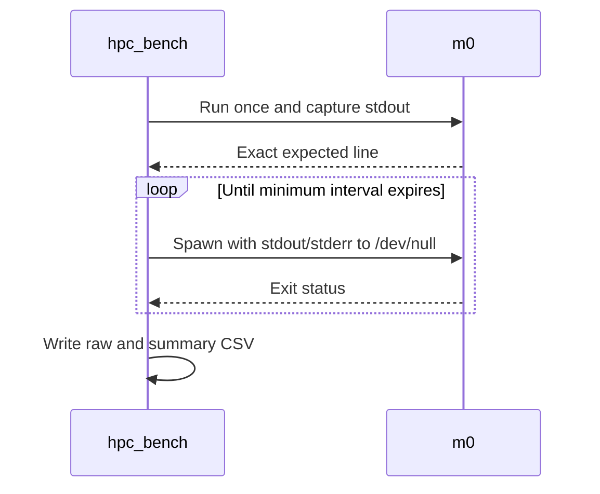

# Performance

> [!WARNING]
> `m0` is a smoke check, not a speed test. It verifies one line of output and
> then measures fresh process launches. Do not quote that number as algorithm
> performance or compare it between machines.

## Current commands

| Command | Work done |
| --- | --- |
| `make bench self-test` | Checks maths, CSV, bootstrap, and process launch. |
| `make bench gates` | Checks profile and sanitizer timing guards. |
| `make bench smoke PRESET=profile` | Writes a short local smoke CSV. |
| `make bench standard PRESET=profile` | Runs the longer diagnostic tier. |
| `make bench publication PRESET=profile` | Runs the longest diagnostic tier. |
| `make pgo gen TARGET=m0` | Generates test PGO data with `m0`. |
| `make pgo use TARGET=m0` | Builds from that profile and runs CTest. |
| `make report TARGET=m0 PRESET=profile` | Runs a report-only compile. |

The three timing tiers come from `tools/config/benchmark.yml`.

| Tier | Warm-ups | Samples | Groups | Recorded | Interval | Floor |
| --- | ---: | ---: | ---: | ---: | ---: | ---: |
| Smoke | 1 | 3 | 1 | 3 | 100 ms | 0.4 s |
| Standard | 3 | 15 | 3 | 45 | 250 ms | 12 s |
| Publication | 5 | 30 | 5 | 150 | 1 s | 155 s |

`Floor` is the warm-up and sample minimum, before verification, spawning, and
file output. A sample keeps launching `m0` until its interval expires.

> [!CAUTION]
> `process_runs` groups samples inside one `hpc_bench` process. It does not
> relaunch the harness between groups.

## What the harness measures

The current runner does this:



On Linux the clock is `CLOCK_MONOTONIC_RAW`; elsewhere it falls back to
`std::chrono::steady_clock`. Timer-call overhead is not subtracted. Each
sample times a batch, so `ns/op` is elapsed time divided by launches.[^batch]

The timed launches check exit status, not output. Output is checked once
before timing. The CSV checksum is FNV-1a over the expected line; it is not a
fresh checksum from every timed launch.

Raw rows go to `results/raw/`; summaries go to `results/summary/`. The script
adds the Git commit, binary SHA-256, compiler, host, CPU, preset, thread/rank
labels, and the mode, sanitizer, coverage, and LTO states. It does not yet
record the complete compiler command. For `m0`, thread and rank values are
labels only.

The C++ summary calculates:

- minimum, median, mean, and maximum;
- median absolute deviation;
- sample standard deviation with an `n - 1` denominator;
- linearly interpolated p5 and p95;
- coefficient of variation;
- a fixed-seed, 10,000-resample bootstrap interval for the median.

No outlier is removed. A failed run aborts instead of writing an `invalid`
row. Speedup and paired-confidence columns exist in the CSV but are blank;
the current harness does not calculate them yet.

[^batch]: A value below one clock tick is a batch-throughput average.

## Run the runner locally

```bash
make bench self-test PRESET=profile
make bench gates TARGET=m0
make bench smoke PRESET=profile TARGET=m0
```

## When a result is worth reporting

For `m2` once it exists:

1. Check the result against a trusted scalar answer before timing.
2. Keep allocation, parsing, setup, logging, and file output outside a kernel
   interval. Measure them separately for end-to-end work.
3. Use the same source, compiler, flags, input, seed, CPU type, affinity, and
   NUMA placement for both sides of a comparison.
4. Build native code in the same Slurm allocation and CPU class where it runs.
5. Pin threads and ranks. Treat SMT as a separate experiment.
6. Interleave A/B cases so drift does not favour whichever binary ran first.
7. Run counters separately from clean wall-clock timing.
8. Keep every raw sample and the binary hash.
9. Reject a row only for a concrete fault: wrong answer, wrong placement,
   migration, throttling, interrupted job, or wrong architecture.

> [!IMPORTANT]
> A peak result must come from a clean, uninstrumented peak build. ASan,
> UBSan, TSan, coverage, Valgrind, `perf record`, and tracing all change the
> program. Exclude those builds from timing comparisons.

Shared GitHub runners only prove the harness still starts and writes valid
CSV. Their neighbours, frequency, and scheduling are not controlled.

## Comparison maths

For one sample, the reported unit cost is:

$$
x_i = \frac{\text{elapsed nanoseconds}_i}
           {\text{useful operations}_i}
$$

Compare paired A/B samples from the same allocation. For pair $i$:

$$
S_i = \frac{x_{A,i}}{x_{B,i}}
$$

Report the median paired speed-up and its bootstrap 95% interval. Call B
faster only when the complete interval is above 1, the absolute saving
matters, correctness still passes, and no representative size regresses.
A coefficient-of-variation threshold alone does not establish reliability.

For $p$ workers:

$$
S_p = \frac{T_1}{T_p}, \qquad E_p = \frac{S_p}{p}
$$

Report bandwidth or floating-point rate only when the byte and operation
counts are defensible:

$$
\text{GB/s} = \frac{\text{bytes}}{10^9 T}, \qquad
\text{GFLOP/s} = \frac{\text{FLOPs}}{10^9 T}
$$

Normalise counters as cycles, instructions, cache misses, and branch misses
per useful operation. Raw totals are hard to compare when workloads differ.

## Tune in this order

| Order | Question | Evidence |
| ---: | --- | --- |
| 1 | Is the answer right? | Scalar check, invariants, CTest |
| 2 | Can the algorithm do less work? | Operation count and phase timing |
| 3 | Is memory laid out and walked well? | Cache misses, bandwidth, profile |
| 4 | Are allocations or branches hot? | Profile and source audit |
| 5 | Did the compiler vectorise the right loop? | Report and disassembly |
| 6 | Does threading scale? | Core sweep, speedup, and efficiency |
| 7 | Is MPI waiting or moving too much? | Compute/comm/wait timing |
| 8 | Is CUDA limited by transfer, launch, or kernel work? | Events, Nsight |
| 9 | Do LTO, PGO, or BOLT move the median? | Controlled A/B run |

## Compiler reports and profiling

Start with the quick checks:

```bash
make report TARGET=m0 PRESET=profile
make profile perf-stat TARGET=m0 PRESET=profile
make profile perf-record TARGET=m0 PRESET=profile
make explore assembly TARGET=m0 PRESET=profile
```

`make report` recompiles the selected source at `-O3`; it does not inspect the
already-built executable. For `m0`, that compile also disables loop and SLP
vectorisation. Use it for compiler diagnostics, then inspect the actual
binary with `make explore assembly`.

`perf` is Linux-only and may be blocked by the cluster. Record that limit.
`llvm-mca` is for a small, known hot assembly region. `llvm-exegesis` measures
instructions, not the application.

Pick one tool for one question. Callgrind, Cachegrind, Massif, HPCToolkit,
Score-P, Scalasca, LIKWID, and PAPI are optional.

## LTO, PGO, BOLT, and floating point

LTO is an explicit CMake experiment:

```bash
cmake --preset mac-peak -DHPC_ENABLE_LTO=ON
cmake --build --preset mac-peak --target m0
ctest --preset mac-peak
```

On a cluster, use the matching peak preset inside its allocation. Compare LTO
against the same compiler and workload without LTO.

PGO has a checked command path:

```bash
make pgo gen TARGET=m0
make pgo use TARGET=m0
```

PGO runs with `m0` only test the command path; they do not measure a useful
speed-up. `make bolt` also skips because no suitable target exists.

There is no fast-math switch. Add one only after numerical tests cover NaN,
infinity, signed zero, tolerances, invariants, and reduction-order changes.

## MPI and CUDA timing

MPI and CUDA are not implemented. Their timing rules are:

- use rank-local `MPI_Wtime()` intervals and reduce elapsed time with
  `MPI_MAX`;
- split MPI compute, communication, waiting, I/O, and total time;
- use CUDA events for device work and a monotonic host clock end to end;
- split host-to-device, kernel, device-to-host, and total time;
- warm the CUDA context before collecting samples.
